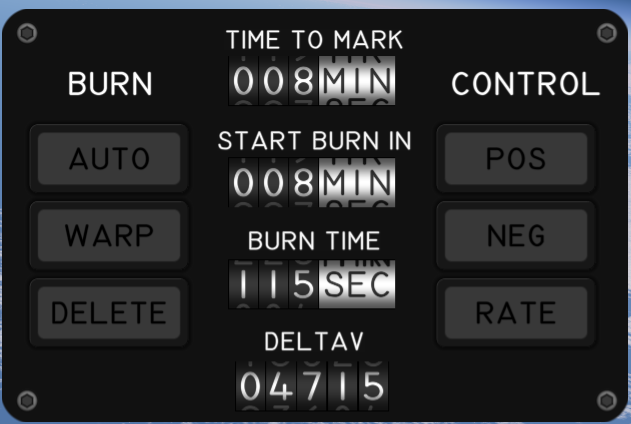
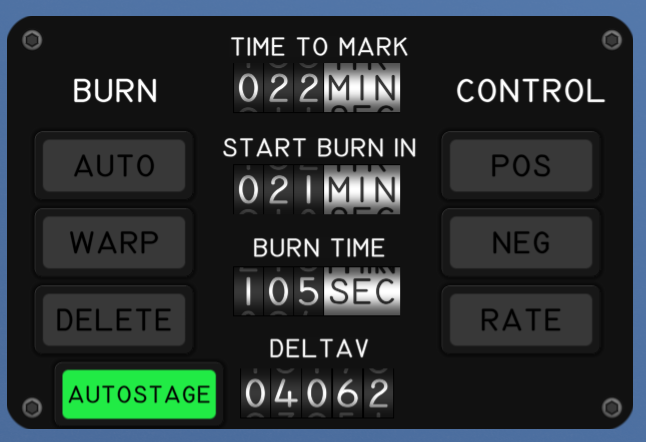

# AutoStage [](https://opensource.org/licenses/MIT)

Automatic staging for [Kitten Space Agency](https://ahwoo.com/app/100000/kitten-space-agency).

Activates the next sequence whenever active engines run out of propellant. Works during auto-burns (continues the burn instead of aborting) and manual burns.

<table>
  <tr>
    <th align="center">Stock</th>
    <th align="center">With AutoStage</th>
  </tr>
  <tr valign="top">
    <td></td>
    <td></td>
  </tr>
</table>

This mod is written against the [StarMap loader](https://github.com/StarMapLoader/StarMap).

Validated against KSA build version 2026.4.18.4206.

## Features

- **AUTOSTAGE toggle button** on the BurnControl gauge panel
- **Auto-burn continuation** - maintains BurnMode=Auto through staging so planned burns don't abort
- **Cascade staging** - stages again if the next stage is empty or only has decouplers
- **Configurable staging delays** - independent delays for decouplers and engines, simulating realistic separation and engine spool-up time
- **On-screen countdowns** - "Decouple in X.Xs" and "Ignition in X.Xs" alerts during a delayed stage so you can see what's about to happen

## Staging Delays

Two delays are configurable per part variant, both measured from the staging trigger:

- **Engine ignition delay** - default values per stock engine variant (the small EngineA1 ignites after 2 s, EngineA3 after 3 s, etc.)
- **Decoupler delay** - default 0 s (fires immediately, matches stock behaviour)

Set the decoupler delay shorter than the engine delay if you want the lower stage to drop away before the upper stage lights up.

### Configuration

**Settings window (Settings > Mods > AutoStage Settings):** Two sections, "Engine Ignition Delays" and "Decoupler Delays". All known part variants are listed with an input field for the delay in seconds. Click "Save" to persist changes.

**Part Window (right-click part > Window):** Override the delay for a specific sequence on the current vehicle. Engines show "Ignition Delay", decouplers show "Decoupler Delay". Per-vehicle overrides take priority over the global config.

### Config files

Global config is stored in `Documents\My Games\Kitten Space Agency\mods\AutoStage\autostage.toml`:

```toml
[engine_delays]
CorePropulsionA_Prefab_EngineA2 = 2.0
CorePropulsionA_Prefab_EngineA3 = 5.0

[decoupler_delays]
CoreFairingA_Prefab_Interstage3W3HB = 1.0
```

Per-vehicle sequence overrides are stored in `Documents\My Games\Kitten Space Agency\mods\AutoStage\vehicles\<vehicle-id>.toml`. These files are created automatically when you set an override in the Part Window. They have separate `[sequence_delays]` (engines) and `[decoupler_delays]` sections.

Removing the mod does not affect / corrupt game saves.

## Installation

1. Install [StarMap](https://github.com/StarMapLoader/StarMap) and [KittenExtensions](https://github.com/tsholmes/KittenExtensions).
2. Download the latest release from the [Releases](https://github.com/Maximilian-Nesslauer/KSA-AutoStage/releases) tab.
3. Extract into `Documents\My Games\Kitten Space Agency\mods\AutoStage\`.
4. The game auto-discovers new mods and prompts you to enable them. Alternatively, add to `Documents\My Games\Kitten Space Agency\manifest.toml`:

```toml
[[mods]]
id = "AutoStage"
enabled = true
```

## Dependencies

| Package | Purpose | Tested version |
| --- | --- | --- |
| [StarMap](https://github.com/StarMapLoader/StarMap) | Mod loader, required at runtime (see [Installation](#installation)) | 0.4.5 |
| [KittenExtensions](https://github.com/tsholmes/KittenExtensions) | Required at runtime for XML patching | v0.4.0 |

## Build dependencies

Required only to build the mod from source. Targets **.NET 10**.

| Package | Source | Tested Version |
| --- | --- | --- |
| [StarMap.API](https://github.com/StarMapLoader/StarMap) | NuGet | 0.3.6 |
| [Lib.Harmony](https://www.nuget.org/packages/Lib.Harmony) | NuGet | 2.4.2 |

## Mod compatibility

- Known conflicts: none

## Community

Thread on the KSA forums: https://forums.ahwoo.com/threads/autostage.891/

## Check out my other mods

- [StageInfo](https://github.com/Maximilian-Nesslauer/KSA-StageInfo) - per-stage dV, TWR and burn time readouts in the stage info panel ([forum thread](https://forums.ahwoo.com/threads/stageinfo.905/))
- [AdvancedFlightComputer](https://github.com/Maximilian-Nesslauer/KSA-AdvancedFlightComputer) - set periapsis / set apoapsis / match or set inclination quick-tools in the Transfer Planner, plus hyperbolic-target support (Oumuamua, 2I/Borisov, 3I/ATLAS)
