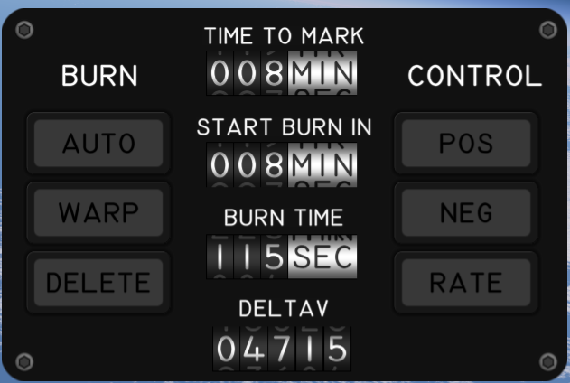
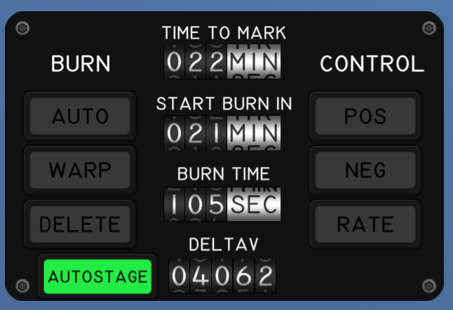

# AutoStage [](https://opensource.org/licenses/MIT)

Automatic staging for [Kitten Space Agency](https://ahwoo.com/app/100000/kitten-space-agency).

Activates the next sequence whenever active engines run out of propellant, and drops burnt-out boosters while the rest of the stage keeps firing. Works during auto-burns (continues the burn instead of aborting) and manual burns.

<table>
  <tr>
    <th align="center">Stock</th>
    <th align="center">With AutoStage</th>
  </tr>
  <tr valign="top">
    <td></td>
    <td></td>
  </tr>
</table>

This mod is written against the [StarMap loader](https://github.com/StarMapLoader/StarMap).

Validated against KSA build version 2026.8.22.5348.

## Features

- **AUTOSTAGE toggle button** on the EngineControl gauge panel, in the free slot under RCS
- **Auto-burn continuation** - maintains BurnMode=Auto through staging so planned burns don't abort
- **Cascade staging** - stages again if the next stage is empty or only has decouplers
- **Spent stage drop** - sheds burnt-out boosters as soon as they quit, without waiting for the core stage to run dry
- **Configurable staging delays** - independent delays for decouplers and engines, simulating realistic separation and engine spool-up time
- **On-screen countdowns** - "Decouple in X.Xs" and "Ignition in X.Xs" alerts during a delayed stage so you can see what's about to happen

## Spent Stage Drop

A launch stage that mixes solid boosters with a liquid core does not run out of propellant all at once. The boosters burn out first, and the sequence that drops them exists precisely for that moment, but a staging trigger that waits for *every* active engine to go dry never fires while the core is still burning, so the empty booster casings ride along as dead mass.

AutoStage therefore also stages when the next sequence would jettison nothing but burnt-out hardware. Before staging it works out which parts each decoupler in that sequence would separate, and only fires when:

- the sequence activates no engine (so it cannot light the next stage early),
- every active engine in the jettisoned parts is spent,
- at least one engine that stays with the vehicle is still firing, and
- nothing in the jettisoned parts is an engine that has never been activated.

It also refuses when the parts to be jettisoned still hold propellant a retained engine can draw from, or when an enabled fuel link crosses the separation, so crossfeed setups are not cut off mid-burn.

Besides the dead mass, this also fixes the burn estimate: the flight computer sums thrust and mass flow over every engine flagged active, whether or not it still has propellant, so a spent booster left attached makes a planned burn look shorter than it is.

Vehicles without boosters never see a jettison that mixes spent and firing engines, so their staging is unchanged. Turn it off with "Drop spent stages early" in the settings window if you want staging to wait for a full burnout.

## Staging Delays

Two delays are configurable per part variant, both measured from the staging trigger:

- **Engine ignition delay** - default values per stock engine variant (the small EngineA1 ignites after 2 s, EngineA3 after 3 s, etc.)
- **Decoupler delay** - default 0 s (fires immediately, matches stock behaviour)

Set the decoupler delay shorter than the engine delay if you want the lower stage to drop away before the upper stage lights up.

### Configuration

**Settings window (Settings > Mods > AutoStage Settings):** A "Drop spent stages early" checkbox, then two sections, "Engine Ignition Delays" and "Decoupler Delays". All known part variants are listed with an input field for the delay in seconds. Every setting takes effect immediately; click "Save" to persist it.

**Part Window (right-click part > Window):** Override the delay for a specific sequence on the current vehicle. Engines show "Ignition Delay", decouplers show "Decoupler Delay". A part can put each of its modules in a different sequence, so it gets one block per sequence it fires something in, each naming the module it covers: a launch escape tower with a motor and two mounts shows three. Per-vehicle overrides take priority over the global config.

### Config files

Global config is stored in `Documents\My Games\Kitten Space Agency\mods\AutoStage\autostage.toml`:

```toml
[staging]
drop_spent_stages = true

[engine_delays]
CorePropulsionA_Prefab_EngineA2 = 2.0
CorePropulsionA_Prefab_EngineA3 = 5.0

[decoupler_delays]
CoreFairingA_Prefab_Interstage3W3HB = 1.0
```

Per-vehicle sequence overrides are stored in `Documents\My Games\Kitten Space Agency\mods\AutoStage\vehicles\<vehicle-id>.toml`. These files are created automatically when you set an override in the Part Window. They have separate `[sequence_delays]` (engines) and `[decoupler_delays]` sections.

Removing the mod does not affect / corrupt game saves.

## Installation

1. Install [StarMap](https://github.com/StarMapLoader/StarMap) and [KittenExtensions](https://github.com/tsholmes/KittenExtensions).
2. Download the latest release from the [GitHub Releases](https://github.com/Maximilian-Nesslauer/KSA-AutoStage/releases) tab or from [SpaceDock](https://spacedock.info/mod/4254/AutoStage).
3. Extract into `Documents\My Games\Kitten Space Agency\mods\AutoStage\`.
4. The game auto-discovers new mods and prompts you to enable them. Alternatively, add to `Documents\My Games\Kitten Space Agency\manifest.toml`:

```toml
[[mods]]
id = "AutoStage"
enabled = true
```

## Dependencies

| Package | Purpose | Tested version |
| --- | --- | --- |
| [StarMap](https://github.com/StarMapLoader/StarMap) | Mod loader, required at runtime (see [Installation](#installation)) | 0.4.6 |
| [KittenExtensions](https://github.com/tsholmes/KittenExtensions) | Required at runtime for XML patching | v0.4.0 |

## Build dependencies

Required only to build the mod from source. Targets **.NET 10**.

| Package | Source | Tested Version |
| --- | --- | --- |
| [StarMap.API](https://github.com/StarMapLoader/StarMap) | NuGet | 0.3.6 |
| [Lib.Harmony](https://www.nuget.org/packages/Lib.Harmony) | NuGet | 2.4.2 |

## Testing

`AutoStage.HarnessTests/` is a developer-only test suite for [HeadlessHarness](https://github.com/Maximilian-Nesslauer/KSA-HeadlessHarness), which brings the real game up GPU-free and runs plug-in tests against the live simulation:

- `autostage-api-drift` boots AutoStage's actual load path and checks every reflection target and the gauge enum injection against the current game build, so an update that breaks the mod is caught without flying anything.
- `autostage-flight` flies a staged save at full manual throttle and asserts that AutoStage activates every remaining engine sequence on its own and that each one actually lights. A trailing decoupler-only sequence is left standing on purpose, since AutoStage only stages while an engine is still ahead.
- `autostage-delays` measures that configured decoupler and engine ignition delays fire on time.
- `autostage-spent-drop` flies a save whose launch stage mixes boosters with a core and asserts the boosters are shed as soon as they burn out, never earlier, and that the core is still firing afterwards.

To run it: build this solution and the HeadlessHarness repo, checked out as a sibling of this one (their `CopyToMods` targets deploy everything), then run the harness's `scripts/run-headless.ps1` (optionally with a `-Tests` name filter). The flying tests use the save named by `KSA_HEADLESS_VEHICLE` and skip when it is unset; `autostage-spent-drop` instead takes its save from `-Vehicles` / `KSA_HEADLESS_VEHICLES` and defaults to "Test Vehicle 1". That default is the only end-to-end cover of the jettison analysis, so it fails rather than skips when the save is missing: provide a save whose launch stage mixes boosters with a core under that name, or name a substitute in `KSA_HEADLESS_VEHICLES`. Leave the deployed test mod disabled for normal play; it only does anything inside a harness run and is not part of the released mod.

## Mod compatibility

- Known conflicts: none

## Community

Thread on the KSA forums: https://forums.ahwoo.com/threads/autostage.891/

## Check out my other mods

- [AdvancedFlightComputer](https://github.com/Maximilian-Nesslauer/KSA-AdvancedFlightComputer) - Transfer Planner quick-tools (set Pe/Ap, match/set inclination, circularize), multi-pass burn splitting, and hyperbolic-target support (Oumuamua, 2I/Borisov, 3I/ATLAS) ([forum thread](https://forums.ahwoo.com/threads/advanced-flight-computer.783/))
- [AutoRemoveFinishedBurns](https://github.com/Maximilian-Nesslauer/KSA-AutoRemoveFinishedBurns) - automatically removes finished auto-burns from the burn plan ([forum thread](https://forums.ahwoo.com/threads/autoremovefinishedburns.928/))
- [DeltaVMap](https://github.com/Maximilian-Nesslauer/KSA-DeltaVMap) - interactive delta-v subway map and transfer-window planner, auto-generated from the loaded system ([forum thread](https://forums.ahwoo.com/threads/deltavmap.978/))
- [MeasureTools](https://github.com/Maximilian-Nesslauer/KSA-MeasureTools) - click-to-measure ruler, protractor, and surface measuring in the map view ([forum thread](https://forums.ahwoo.com/threads/measuretools.992/))
